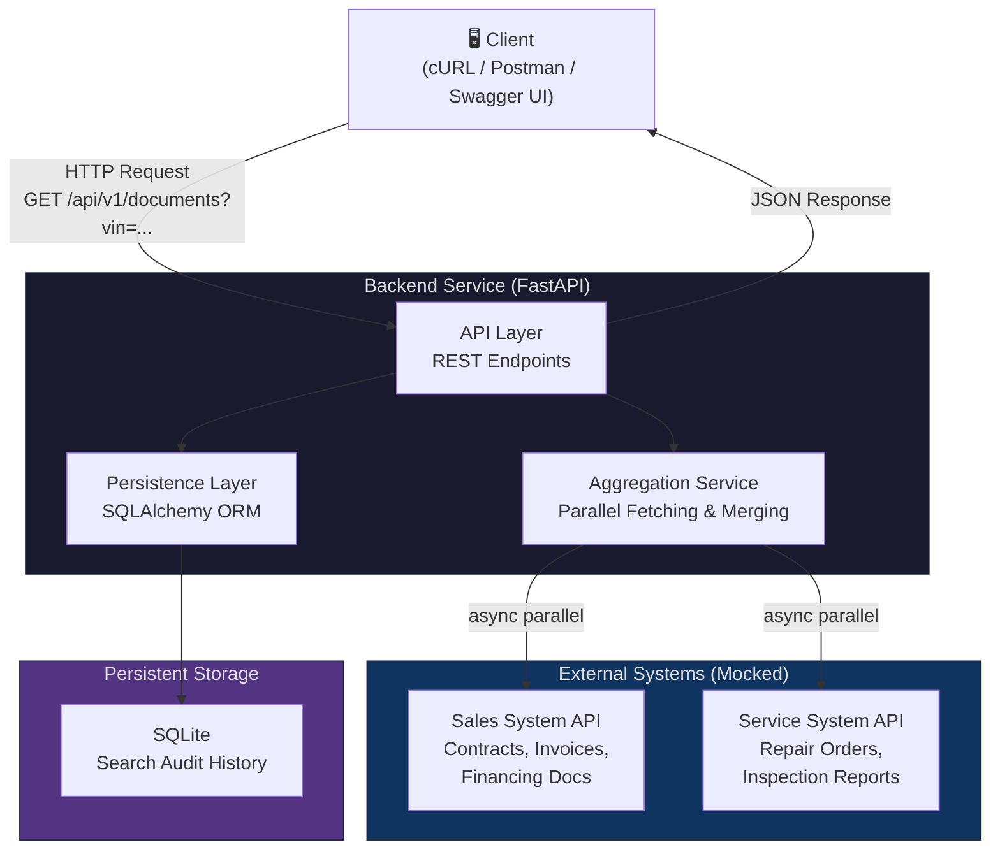
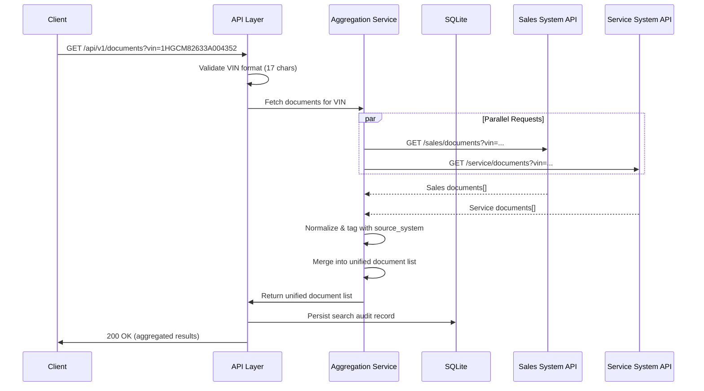
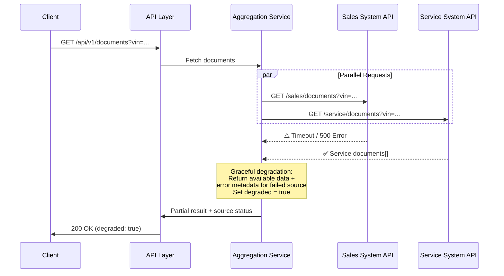
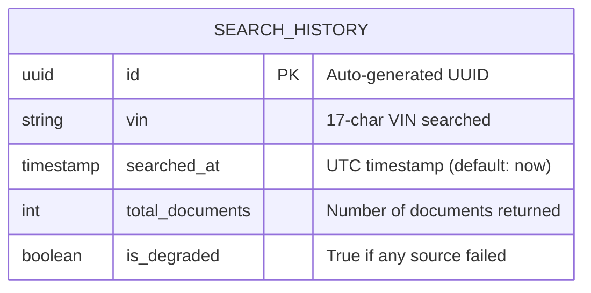

# System Design Document – Unified Document Viewer

> Backend Implementation (Python)

---

## Table of Contents

1. [Overview](#1-overview)
2. [Architecture Diagram](#2-architecture-diagram)
3. [Component Description](#3-component-description)
4. [Data Flow](#4-data-flow)
5. [API Design](#5-api-design)
6. [External API Contracts](#6-external-api-contracts)
7. [Data Model](#7-data-model)
8. [Technology Stack & Justifications](#8-technology-stack--justifications)
9. [Scalability, Performance & Reliability](#9-scalability-performance--reliability)
10. [Assumptions](#10-assumptions)
11. [Requirements Coverage](#11-requirements-coverage)
12. [Appendix](#appendix)

---

## 1. Overview

### 1.1 Problem Statement

Dealerships use multiple disconnected systems to manage vehicle-related documents — a **Sales System** for purchase contracts, invoices, and financing agreements, and a **Service System** for repair orders, inspection reports, and maintenance records. Users currently must search each system individually, creating a fragmented and time-consuming experience.

### 1.2 Proposed Solution

Build a **Unified Document Viewer** backend service that provides a single REST API endpoint. Given a Vehicle Identification Number (VIN), the service queries both dealership systems **in parallel**, aggregates the results, and returns a consolidated list of documents — each clearly tagged with its source system.

### 1.3 Scope

- **In scope:** Backend REST API, data aggregation, persistent search audit storage, mock external APIs, testing.
- **Out of scope:** Frontend UI (mocked/stubbed via cURL examples and OpenAPI spec), authentication/authorization (documented as future work), real dealership system integrations.

---

## 2. Architecture Diagram

### 2.1 High-Level Architecture



> **Key principle:** The Aggregation Service is a stateless orchestrator — it fetches, normalises, and returns documents without storing them. SQLite provides lightweight persistent storage for search audit history, proving the DB integration requirement.

### 2.2 Sequence Diagram – Document Search Flow



### 2.3 Error Handling Flow (Partial Failure)



> **Why HTTP 200 (not 206)?** The client requested a unified document view and the server successfully processed that request. One upstream dependency being unavailable is reflected in the response body via `"degraded": true` and per-source status metadata. HTTP 206 Partial Content is semantically intended for range requests (RFC 7233) and should not be repurposed for upstream partial failures.

---

## 3. Component Description

### 3.1 API Layer

| Aspect           | Detail                                                                 |
|------------------|------------------------------------------------------------------------|
| Role             | Entry point for all client requests                                    |
| Responsibilities | Request validation, routing, response serialization, error handling    |
| Technology       | FastAPI with Pydantic models                                           |

### 3.2 Aggregation Service

| Aspect           | Detail                                                                              |
|------------------|------------------------------------------------------------------------------------|
| Role             | Core business logic – orchestrates parallel data fetching and merging               |
| Responsibilities | Parallel HTTP calls, response normalization, source tagging, timeout management     |
| Technology       | Python asyncio + httpx (async HTTP client)                                          |

### 3.3 Persistence Layer (Database)

| Aspect              | Detail                                                                          |
|----------------------|---------------------------------------------------------------------------------|
| Role                 | Persistent storage for search audit history                                     |
| Responsibilities     | Recording every VIN search with result metadata                                 |
| Technology           | SQLite (async via aiosqlite) + SQLAlchemy 2.0 (async)                           |
| Schema creation      | Auto-created on startup via `Base.metadata.create_all` in FastAPI lifespan      |

### 3.4 Mock External APIs

| Aspect           | Detail                                                                 |
|------------------|------------------------------------------------------------------------|
| Role             | Simulate real dealership systems for development and testing           |
| Responsibilities | Serve realistic mock data, simulate latency and errors                 |
| Technology       | Separate FastAPI applications (Port 8001 and 8002)                     |

---

## 4. Data Flow

### 4.1 Happy Path

```
1. Client sends GET /api/v1/documents?vin=<VIN>
2. API Layer validates VIN format (17 alphanumeric characters, ISO 3779)
3. Aggregation Service triggers parallel requests:
   a. Sales System API → returns sales documents
   b. Service System API → returns service documents
4. Aggregation Service normalizes both responses into a unified schema
5. Each document is tagged with source_system ("sales" | "service")
6. Search audit record is persisted to SQLite (VIN, document count, degraded status)
7. Unified document list returned to client (HTTP 200)
```

### 4.2 Partial Failure Path

```
1. Steps 1-3 same as above
2. One external API fails (timeout, 5xx, network error)
3. Aggregation Service collects available results from the successful source
4. Response includes:
   - Documents from the successful source
   - Per-source status metadata (success/error details)
   - "degraded": true flag
5. Search audit record persisted with is_degraded = true
6. HTTP 200 returned to client with degraded status
   (the request itself was processed successfully; upstream
    unavailability is conveyed via response body metadata)
```

---

## 5. API Design

### 5.1 Endpoints

| Method | Endpoint               | Description                                    |
|--------|------------------------|------------------------------------------------|
| GET    | `/api/v1/documents`    | Search and aggregate documents by VIN          |
| GET    | `/api/v1/history`      | Query past VIN search audit records            |
| GET    | `/`                    | Root welcome message                           |

### 5.2 Search Endpoint – Request/Response

**Request:**
```
GET /api/v1/documents?vin=1HGCM82633A004352
```

**Response (200 OK – all sources successful):**
```json
{
  "vin": "1HGCM82633A004352",
  "documents": [
    {
      "id": "doc_a1b2c3",
      "external_id": "SALE-001",
      "vin": "1HGCM82633A004352",
      "title": "Vehicle Purchase Agreement",
      "document_type": "contract",
      "source_system": "sales",
      "date": "2024-03-15",
      "metadata": {
        "dealer_name": "AutoNation Honda",
        "amount": 32500.00
      }
    },
    {
      "id": "doc_d4e5f6",
      "external_id": "SVC-101",
      "vin": "1HGCM82633A004352",
      "title": "60,000 Mile Service Report",
      "document_type": "service_report",
      "source_system": "service",
      "date": "2025-01-20",
      "metadata": {
        "mileage": 60234,
        "technician": "John Smith"
      }
    }
  ],
  "sources": {
    "sales": {"status": "success", "count": 2},
    "service": {"status": "success", "count": 3}
  },
  "degraded": false,
  "timestamp": "2026-08-13T10:30:00Z"
}
```

**Response (200 OK – partial failure, degraded):**
```json
{
  "vin": "1HGCM82633A004352",
  "documents": ["..."],
  "sources": {
    "sales": {"status": "error", "error": "Connection timeout after 3000ms"},
    "service": {"status": "success", "count": 3}
  },
  "degraded": true,
  "timestamp": "2026-08-13T10:30:00Z"
}
```

### 5.3 Search History Endpoint

**Request:**
```
GET /api/v1/history?vin=1HGCM82633A004352&limit=20&offset=0
```

**Response (200 OK):**
```json
{
  "total": 5,
  "records": [
    {
      "id": "550e8400-e29b-41d4-a716-446655440000",
      "vin": "1HGCM82633A004352",
      "searched_at": "2026-08-13T10:30:00Z",
      "total_documents": 5,
      "is_degraded": false
    }
  ]
}
```

---

## 6. External API Contracts

The Aggregation Service communicates with two mocked external APIs. Each returns documents for a given VIN.

### 6.1 Sales System API

```
GET /sales/documents?vin={vin}
```

**Response:**
```json
{
  "documents": [
    {
      "id": "SALE-001",
      "title": "Vehicle Purchase Agreement",
      "type": "contract",
      "date": "2024-03-15",
      "metadata": {
        "dealer_name": "AutoNation Honda",
        "amount": 32500.00
      }
    }
  ]
}
```

### 6.2 Service System API

```
GET /service/documents?vin={vin}
```

**Response:**
```json
{
  "documents": [
    {
      "id": "SVC-001",
      "title": "60,000 Mile Service Report",
      "type": "service_report",
      "date": "2025-01-20",
      "metadata": {
        "mileage": 60234,
        "technician": "John Smith"
      }
    }
  ]
}
```

### 6.3 Aggregation Process

The Aggregation Service handles these responses as follows:

1. Calls both APIs concurrently via `asyncio.gather(return_exceptions=True)`
2. Validates and normalizes each response into a common `UnifiedDocument` schema
3. Maps `type` → `document_type` and adds `source_system = "sales"` or `"service"`
4. Assigns an internal `id` (e.g., `doc_a1b2c3`) while preserving the original `id` as `external_id`
5. Merges both lists into a single result

---

## 7. Data Model

### 7.1 Database Schema

The MVP uses a single table to persist search audit records, fulfilling the "persistent database" requirement:



> **Design rationale:** The aggregator's primary role is to query and merge documents from external systems in real time — it does not own or store document data. The `search_history` table provides a persistent audit trail of every search request, demonstrating the database integration requirement while keeping the architecture clean.

### 7.2 Document Types (from External Sources)

| Source System | Document Types                                             |
|---------------|-----------------------------------------------------------|
| Sales         | `contract`, `invoice`, `financing_agreement`, `warranty`   |
| Service       | `repair_order`, `inspection_report`, `maintenance_record`  |

### 7.3 Future Data Model Evolution

For a production system, the data model could be extended with:

- **DOCUMENT** table: Cache document metadata locally for faster repeat queries
- **SEARCH_RESULT** junction table: Link searches to documents (many-to-many)
- **SOURCE_STATUS** table: Detailed per-source status for each search

---

## 8. Technology Stack & Justifications

| Layer            | Technology              | Justification                                                                                   |
|------------------|-------------------------|-------------------------------------------------------------------------------------------------|
| Language         | Python 3.12+            | Strong async ecosystem, rich library support, team familiarity                                  |
| Web Framework    | FastAPI                 | Native async, auto OpenAPI docs, Pydantic validation, high performance (ASGI)                   |
| Async HTTP       | httpx                   | Async-native HTTP client, connection pooling, timeout management, `asyncio.gather` compatible   |
| ORM              | SQLAlchemy 2.0 (async)  | Industry standard, async support, declarative models                                            |
| Database         | SQLite (via aiosqlite)  | Zero-configuration, file-based, async support; sufficient for MVP audit logging                 |
| Validation       | Pydantic v2             | Fast validation, serialization, auto-generated JSON Schema                                      |
| Testing          | pytest + pytest-asyncio | Async test support, fixtures, rich plugin ecosystem                                             |
| Logging          | Python standard logging | Built-in, zero-dependency; structlog can be adopted as a future enhancement                     |

### 8.1 Future Technology Additions

| Layer            | Technology              | Rationale                                                                                       |
|------------------|-------------------------|-------------------------------------------------------------------------------------------------|
| Database (Prod)  | PostgreSQL              | ACID compliance, JSON support, production-ready, scalable; swap via `DATABASE_URL` config       |
| Migrations       | Alembic                 | Version-controlled schema changes for production deployments                                    |
| Caching          | In-memory LRU → Redis   | Reduce redundant external API calls; in-memory for single instance, Redis for distributed       |
| Structured Logging | structlog             | Structured JSON logging, context binding, processor pipeline                                    |
| Tracing          | OpenTelemetry           | Vendor-neutral distributed tracing, W3C Trace Context standard                                  |
| Retry            | tenacity                | Exponential backoff with jitter for transient failures (5xx, timeouts)                          |

---

## 9. Scalability, Performance & Reliability

### 9.1 Scalability

- **Horizontal scaling:** Stateless API design allows multiple instances behind a load balancer
- **Database evolution:** SQLite (MVP) → PostgreSQL (production) via `DATABASE_URL` configuration swap
- **Cache evolution (future):** In-memory LRU → Redis for distributed caching when scaling to multiple instances

### 9.2 Performance

- **Parallel requests:** `asyncio.gather()` for concurrent calls to Sales & Service APIs — the core performance optimization
- **Non-blocking I/O:** Fully async stack (FastAPI + httpx + aiosqlite) maximizes throughput under concurrent load

### 9.3 Reliability

**Implemented (MVP):**

- **Timeouts:** Hard 3.0-second timeout on every outbound request to external APIs, preventing slow upstream services from blocking the response
- **Graceful degradation:** When one source fails (timeout, 5xx, network error), the API returns available documents from the successful source with `degraded: true` and per-source error metadata (HTTP 200)
- **Error isolation:** Each source is fetched independently; one failure cannot crash the entire aggregation (`return_exceptions=True` in `asyncio.gather`)

**Future production improvements:**

- **Retry with backoff:** Limited retries for transient failures only (connection errors, timeouts, HTTP 502/503/504). Policy: max 2 retries, exponential backoff with jitter via `tenacity`
- **Circuit breaker:** Prevent cascading failures when a source is consistently down
- **Bulkhead isolation:** Separate connection pools per external source

### 9.4 Observability Strategy

To ensure the system's health, facilitate debugging, and monitor performance, we employ a comprehensive observability strategy focused on three pillars: logging, metrics, and tracing.

1. **Logging:** 
   - **Current (MVP):** Standard Python logging is used to capture application startup events, request boundaries, and exceptions.
   - **Production Strategy:** We will log all critical paths, including incoming API requests, outbound HTTP calls to the Sales/Service systems, and database transactions. Logs will include contextual metadata (e.g., VIN, `source_system`, HTTP status codes) while strictly masking any PII. We plan to adopt structured JSON logging (via `structlog`) so that logs can be easily ingested and queried by centralized log management systems (like ELK stack, Datadog, or CloudWatch).

2. **Metrics:** 
   - **Strategy:** We will expose a `/metrics` endpoint (using a Prometheus client middleware) to track key Service Level Indicators (SLIs) in real-time.
   - **Key Metrics Tracked:** 
     - **Traffic:** Overall request rate (requests per second) to the `/api/v1/documents` endpoint.
     - **Error Rates:** Tracked globally and independently for each external source (Sales API vs. Service API) to quickly detect partial upstream outages.
     - **Latency:** Request duration percentiles (P50, P90, P99) for our API response time, as well as the latency of the external API calls.

3. **Tracing:** 
   - **Strategy:** To understand request lifecycles and diagnose latency bottlenecks across distributed components, we will implement distributed tracing using **OpenTelemetry**.
   - **Mechanism:** A unique `X-Correlation-ID` (Trace ID) will be generated for every incoming request at the API gateway/entry point. This ID will be automatically injected into the HTTP headers of all outbound requests made by the Aggregation Service to the Sales and Service APIs. This allows us to visualize the entire request flow and pinpoint exactly where a timeout or failure occurred.
---

## 10. Assumptions

| # | Assumption                                                                                           |
|---|------------------------------------------------------------------------------------------------------|
| 1 | VIN follows the ISO 3779 standard (17 alphanumeric characters)                                      |
| 2 | External APIs are RESTful and return JSON                                                            |
| 3 | Document metadata is sufficient (no binary file content is transferred)                               |
| 4 | The system should return partial results rather than failing entirely when one source is unavailable  |
| 5 | Authentication/authorization is out of scope but designed as a pluggable middleware                   |
| 6 | The number of documents per VIN is manageable in memory (< 1000 docs per vehicle)                    |
| 7 | Mock APIs simulate realistic latency and occasional failures                                         |
| 8 | Different upstream systems may reuse the same external document ID independently                     |
| 9 | SQLite is sufficient for MVP; production would use PostgreSQL via `DATABASE_URL` swap                |

---

## 11. Requirements Coverage

| Requirement                                      | Status | Implementation                                                     |
|--------------------------------------------------|--------|---------------------------------------------------------------------|
| Unified VIN Search                               | ✅     | `GET /api/v1/documents?vin=<VIN>` with strict 17-char VIN validation |
| Parallel Sales + Service API requests            | ✅     | `asyncio.gather()` with httpx async client                         |
| Aggregated unified document response             | ✅     | Aggregation Service normalizes and merges both sources              |
| Source system identification                     | ✅     | Each document tagged with `source_system` field (`"sales"` or `"service"`) |
| RESTful backend API                              | ✅     | FastAPI with versioned endpoints (`/api/v1/`)                      |
| Persistent database                              | ✅     | SQLite (async via aiosqlite) for search audit history              |
| Mock external APIs                               | ✅     | Standalone Mock Sales API (port 8001) and Mock Service API (port 8002) |
| Graceful degradation                             | ✅     | Partial failures return HTTP 200 with `degraded: true` and per-source error metadata |

---

## Appendix

### A. Project Structure

```
unified-document-viewer/
├── docs/
│   └── SYSTEM_DESIGN.md          # This document
├── scripts/
│   ├── run_all.sh                # One-command launcher for all 3 servers
│   └── test_api.sh               # cURL-based API smoke tests
├── src/
│   ├── api/
│   │   └── routes/
│   │       ├── documents.py      # GET /api/v1/documents endpoint
│   │       └── history.py        # GET /api/v1/history endpoint
│   ├── core/
│   │   └── config.py             # Application settings & environment variables
│   ├── db/
│   │   ├── __init__.py           # Re-exports Base, engine, get_db_session
│   │   ├── base.py               # SQLAlchemy DeclarativeBase
│   │   └── session.py            # Async engine, session factory & dependency
│   ├── mock_servers/
│   │   ├── sales_api.py          # Standalone Mock Sales API (Port 8001)
│   │   └── service_api.py        # Standalone Mock Service API (Port 8002)
│   ├── models/
│   │   └── search_history.py     # SearchHistory ORM model
│   ├── schemas/
│   │   ├── document.py           # UnifiedDocument & response Pydantic models
│   │   └── history.py            # SearchHistory response Pydantic models
│   ├── services/
│   │   └── aggregator.py         # Parallel document fetching & merging service
│   └── main.py                   # FastAPI main entrypoint
├── tests/
│   ├── unit/
│   │   ├── test_aggregator.py    # Unit tests for aggregation & fault tolerance
│   │   ├── test_documents_endpoint.py  # Unit tests for REST API layer
│   │   ├── test_mock_servers.py  # Tests for mock server functionality
│   │   └── test_schemas_document.py    # Schema validation tests
│   ├── integration/
│   │   └── test_api.py           # Integration tests for full API flow
├── examples.http                 # VS Code REST Client request examples
├── Makefile                      # Command shortcuts for cleanup and management
├── pyproject.toml                # Project metadata & dependencies
└── README.md                     # Project documentation
```
