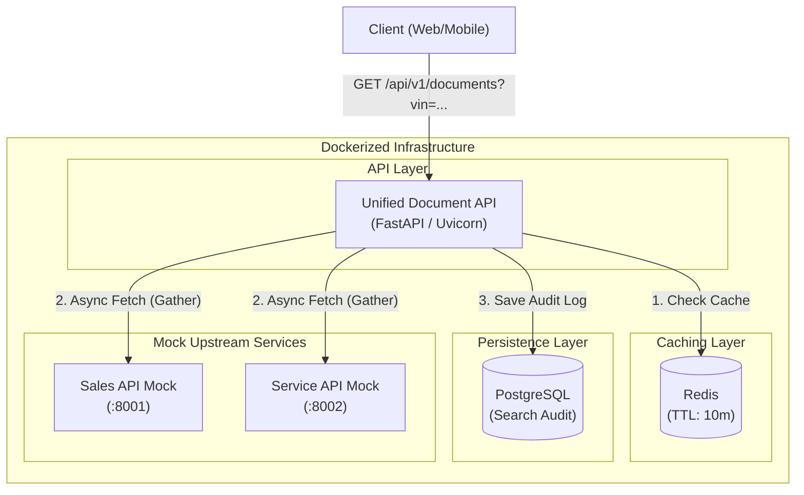

# System Design Document – Unified Document Viewer

> Production-Grade Backend Architecture (FastAPI, Redis, PostgreSQL)

---

## 1. Overview

### 1.1 Problem Statement
Dealerships use disconnected systems to manage vehicle-related documents — a **Sales System** (purchase contracts, invoices) and a **Service System** (repair orders, maintenance). Searching each system individually is fragmented and time-consuming.

### 1.2 Proposed Solution
A **Unified Document Viewer** backend service exposing a single REST API endpoint. Given a Vehicle Identification Number (VIN), the service queries both dealership systems **in parallel**, caches the results for instant subsequent lookups, and returns a consolidated list of documents.

### 1.3 Scope
- **In scope:** Async REST API, parallel data aggregation, Cache-Aside Redis layer, PostgreSQL search audit storage, graceful degradation, Dockerization, CI/CD.
- **Out of scope:** Frontend UI, authentication/authorization.

---

## 2. Architecture Diagram



---

## 3. Core Architectural Decisions

### 3.1 Redis Cache-Aside Pattern
To reduce load on upstream systems and provide sub-10ms response times for repeated queries:
- **Strategy:** Cache-Aside. The application first checks Redis (`documents:{vin}`). On a cache miss, it fetches from upstream APIs, aggregates the data, and writes the result to Redis.
- **TTL:** 10 minutes, ensuring data freshness while absorbing traffic spikes.
- **Fail-Safe Design:** If Redis becomes unreachable, the cache module silently catches the exception, logging a warning and allowing the application to fetch directly from upstream APIs without crashing.

### 3.2 Parallel Async Aggregation
- Uses `asyncio.gather` and `httpx.AsyncClient` to fetch from Sales and Service APIs concurrently.
- Limits total request time to the slowest upstream service rather than the sum of both.

### 3.3 Graceful Degradation & Fault Tolerance
- **Timeouts:** Hard 3.0s timeout on all outbound requests.
- **Partial Failures:** If the Sales API is down, but the Service API responds, the backend will return the Service documents alongside a `degraded: true` flag and per-source error metadata. It **does not** return an HTTP 500 error.

### 3.4 PostgreSQL & Alembic
- **Async ORM:** Uses `asyncpg` with SQLAlchemy 2.0 to maintain a fully non-blocking event loop.
- **Migrations:** Alembic is used for version-controlled database schema migrations.

---

## 4. API Design

### `GET /api/v1/documents`

**Query Parameters:**
- `vin` (string, required): 17-character Vehicle Identification Number.
- `force_refresh` (boolean, optional): If `true`, bypasses the Redis cache and fetches fresh data.

**Response Body (200 OK):**
```json
{
  "vin": "1HGCM82633A004352",
  "documents": [
    {
      "id": "doc_a1b2c3d4",
      "external_id": "SALE-2024-001",
      "vin": "1HGCM82633A004352",
      "title": "Purchase Agreement",
      "document_type": "contract",
      "source_system": "sales",
      "date": "2024-03-15",
      "metadata": { "amount": 32500 }
    }
  ],
  "sources": {
    "sales": { "status": "success", "count": 1 },
    "service": { "status": "error", "error": "Connection timeout" }
  },
  "degraded": true,
  "timestamp": "2026-08-26T15:21:00Z",
  "cache_hit": false
}
```

---

## 5. DevOps & CI/CD Strategy

### 5.1 Docker Orchestration
The entire application stack is containerized using `docker-compose.yml`, which defines 5 services:
1. `api`: The main FastAPI backend.
2. `sales-mock`: Upstream mock server.
3. `service-mock`: Upstream mock server.
4. `postgres`: Database with health checks.
5. `redis`: Cache layer with health checks.

### 5.2 GitHub Actions Pipeline
- **CI (Continuous Integration):** Triggered on PRs. Runs `ruff` for linting and `pytest` for unit testing with coverage. Tests are executed against an in-memory SQLite database to decouple CI from infrastructure.
- **CD (Continuous Delivery):** Triggered on merges to `main`. Builds the Docker image and pushes it to **GitHub Container Registry (GHCR)** automatically, ready for deployment.
