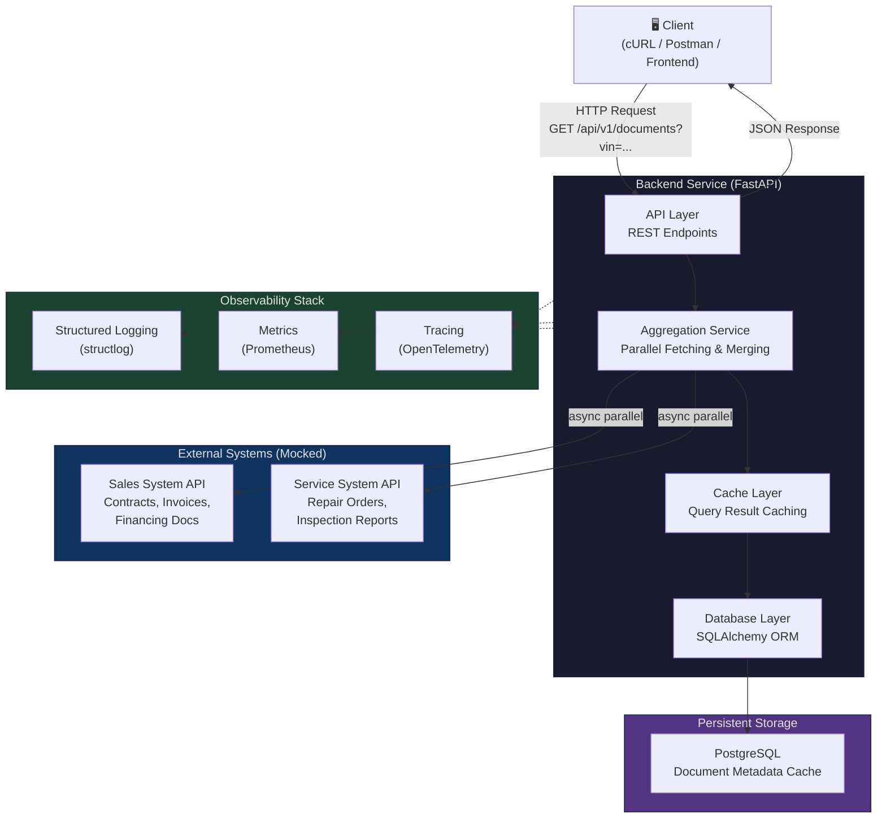
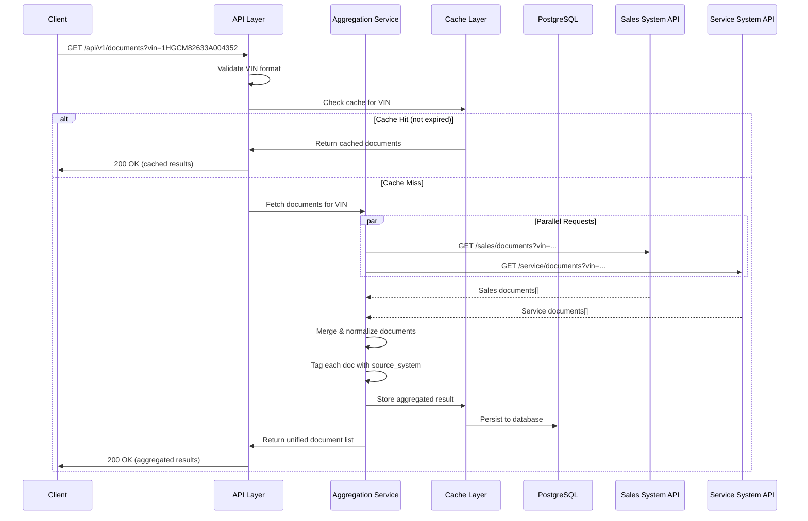
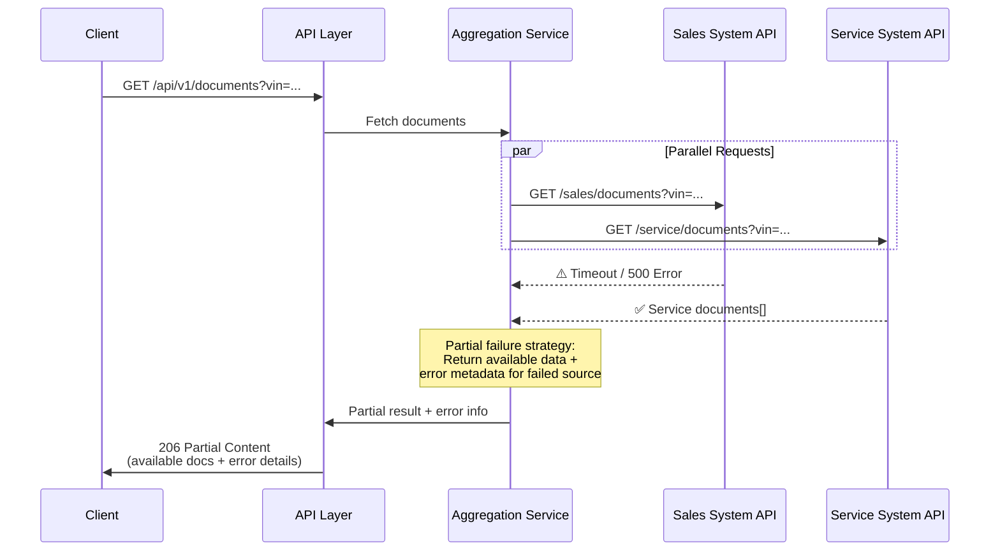
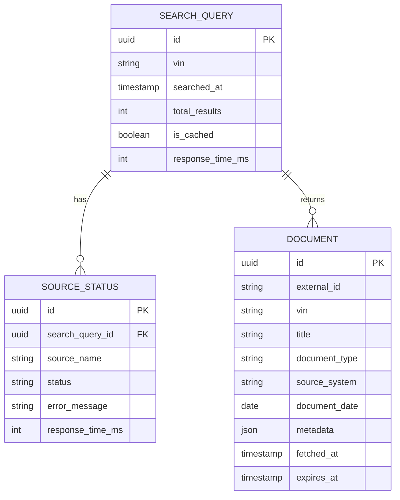
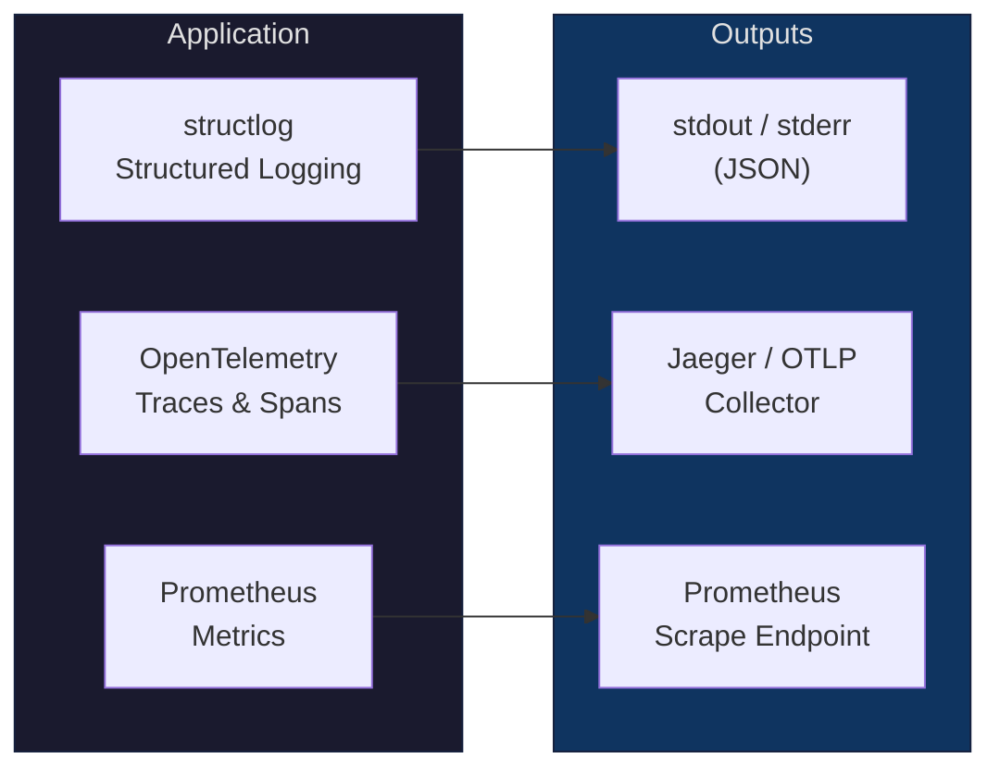

# System Design Document – Unified Document Viewer

> **Scenario D** | Backend Implementation (Python)
> **Author:** Ho Dinh Duy
> **Date:** 2026-08-08

---

## Table of Contents

1. [Overview](#1-overview)
2. [Architecture Diagram](#2-architecture-diagram)
3. [Component Description](#3-component-description)
4. [Data Flow](#4-data-flow)
5. [API Design](#5-api-design)
6. [Data Model](#6-data-model)
7. [Technology Stack & Justifications](#7-technology-stack--justifications)
8. [Scalability, Performance & Reliability](#8-scalability-performance--reliability)
9. [Observability Strategy](#9-observability-strategy)
10. [Assumptions](#10-assumptions)
11. [GenAI Collaboration in Design Phase](#11-genai-collaboration-in-design-phase)

---

## 1. Overview

### 1.1 Problem Statement

Dealerships use multiple disconnected systems to manage vehicle-related documents — a **Sales System** for purchase contracts, invoices, and financing agreements, and a **Service System** for repair orders, inspection reports, and maintenance records. Users currently must search each system individually, creating a fragmented and time-consuming experience.

### 1.2 Proposed Solution

Build a **Unified Document Viewer** backend service that provides a single REST API endpoint. Given a Vehicle Identification Number (VIN), the service queries both dealership systems **in parallel**, aggregates the results, and returns a consolidated list of documents — each clearly tagged with its source system.

### 1.3 Scope

- **In scope:** Backend REST API, data aggregation, persistent storage (caching), mock external APIs, testing, observability.
- **Out of scope:** Frontend UI (mocked/stubbed), authentication/authorization (documented as future work), real dealership system integrations.

---

## 2. Architecture Diagram

### 2.1 High-Level Architecture



### 2.2 Sequence Diagram – Document Search Flow



### 2.3 Error Handling Flow



---

## 3. Component Description

### 3.1 API Layer

| Aspect      | Detail                                                                |
|-------------|-----------------------------------------------------------------------|
| Role        | Entry point for all client requests                                   |
| Responsibilities | Request validation, routing, response serialization, error handling |
| Technology  | FastAPI with Pydantic models                                          |

### 3.2 Aggregation Service

| Aspect      | Detail                                                                     |
|-------------|----------------------------------------------------------------------------|
| Role        | Core business logic – orchestrates parallel data fetching and merging      |
| Responsibilities | Parallel HTTP calls, response normalization, source tagging, timeout management |
| Technology  | Python asyncio + httpx (async HTTP client)                                 |

### 3.3 Cache Layer

| Aspect      | Detail                                                              |
|-------------|---------------------------------------------------------------------|
| Role        | Reduces redundant calls to external APIs                            |
| Responsibilities | TTL-based caching, cache invalidation, cache-aside pattern      |
| Technology  | In-memory (dict/LRU) for MVP, Redis-ready interface for production  |

### 3.4 Database Layer

| Aspect      | Detail                                                          |
|-------------|-----------------------------------------------------------------|
| Role        | Persistent storage for document metadata and search history     |
| Responsibilities | CRUD operations, query optimization, migration management   |
| Technology  | PostgreSQL + SQLAlchemy (async) + Alembic                       |

### 3.5 Mock External APIs

| Aspect      | Detail                                                        |
|-------------|---------------------------------------------------------------|
| Role        | Simulate real dealership systems for development and testing  |
| Responsibilities | Serve realistic mock data, simulate latency and errors    |
| Technology  | Separate FastAPI app or in-process fixtures                   |

---

## 4. Data Flow

### 4.1 Happy Path

```
1. Client sends GET /api/v1/documents?vin=<VIN>
2. API Layer validates VIN format (17 alphanumeric chars, ISO 3779)
3. Cache Layer checks for existing, non-expired results
4. On cache miss → Aggregation Service triggers parallel requests:
   a. Sales System API → returns sales documents
   b. Service System API → returns service documents
5. Aggregation Service normalizes both responses into a unified schema
6. Each document is tagged with source_system ("sales" | "service")
7. Result is cached in DB with TTL
8. Unified document list returned to client
```

### 4.2 Partial Failure Path

```
1. Steps 1-4 same as above
2. One external API fails (timeout, 5xx, network error)
3. Aggregation Service collects available results
4. Response includes:
   - Documents from the successful source
   - An "errors" array detailing which source failed and why
5. HTTP 206 Partial Content returned to client
```

---

## 5. API Design

### 5.1 Endpoints

| Method | Endpoint                     | Description                       |
|--------|------------------------------|-----------------------------------|
| GET    | `/api/v1/documents`          | Search documents by VIN           |
| GET    | `/api/v1/documents/{doc_id}` | Get a specific document by ID     |
| GET    | `/api/v1/health`             | Health check                      |
| GET    | `/api/v1/health/ready`       | Readiness check (DB + externals)  |

### 5.2 Search Endpoint – Request/Response

**Request:**
```
GET /api/v1/documents?vin=1HGCM82633A004352&page=1&page_size=20
```

**Response (200 OK):**
```json
{
  "vin": "1HGCM82633A004352",
  "total_count": 5,
  "documents": [
    {
      "id": "doc_a1b2c3",
      "title": "Vehicle Purchase Agreement",
      "document_type": "contract",
      "source_system": "sales",
      "date": "2024-03-15",
      "metadata": {
        "dealer_name": "AutoNation Honda",
        "amount": 32500.00
      }
    },
    {
      "id": "doc_d4e5f6",
      "title": "60,000 Mile Service Report",
      "document_type": "service_report",
      "source_system": "service",
      "date": "2025-01-20",
      "metadata": {
        "mileage": 60234,
        "technician": "John Smith"
      }
    }
  ],
  "sources": {
    "sales": {"status": "success", "count": 2, "response_time_ms": 120},
    "service": {"status": "success", "count": 3, "response_time_ms": 85}
  },
  "cached": false,
  "timestamp": "2026-08-08T15:21:00Z"
}
```

**Response (206 Partial Content):**
```json
{
  "vin": "1HGCM82633A004352",
  "total_count": 3,
  "documents": [ "..." ],
  "sources": {
    "sales": {"status": "error", "error": "Connection timeout after 5000ms"},
    "service": {"status": "success", "count": 3, "response_time_ms": 85}
  },
  "cached": false,
  "timestamp": "2026-08-08T15:21:00Z"
}
```

---

## 6. Data Model

### 6.1 Entity Relationship Diagram



### 6.2 Document Types

| Source System | Document Types                                             |
|---------------|-----------------------------------------------------------|
| Sales         | `contract`, `invoice`, `financing_agreement`, `warranty`   |
| Service       | `repair_order`, `inspection_report`, `maintenance_record`  |

---

## 7. Technology Stack & Justifications

| Layer            | Technology              | Justification                                                                                   |
|------------------|-------------------------|-------------------------------------------------------------------------------------------------|
| Language         | Python 3.12+            | Strong async ecosystem, rich library support, team familiarity                                  |
| Web Framework    | FastAPI                 | Native async, auto OpenAPI docs, Pydantic validation, high performance (ASGI)                   |
| Async HTTP       | httpx                   | Async-native HTTP client, connection pooling, timeout management, `asyncio.gather` compatible   |
| ORM              | SQLAlchemy 2.0 (async)  | Industry standard, async support, declarative models, Alembic migrations                        |
| Database         | PostgreSQL              | ACID compliance, JSON support, production-ready, scalable                                       |
| Migrations       | Alembic                 | De-facto standard for SQLAlchemy, version-controlled schema changes                             |
| Validation       | Pydantic v2             | Fast validation, serialization, auto-generated JSON Schema                                      |
| Testing          | pytest + pytest-asyncio | Async test support, fixtures, rich plugin ecosystem                                             |
| Logging          | structlog               | Structured JSON logging, context binding, processor pipeline                                    |
| Tracing          | OpenTelemetry           | Vendor-neutral distributed tracing, W3C Trace Context standard                                  |
| Containerization | Docker + docker-compose | Reproducible environments, easy local development, CI/CD ready                                  |

---

## 8. Scalability, Performance & Reliability

### 8.1 Scalability

- **Horizontal scaling:** Stateless API design allows multiple instances behind a load balancer
- **Database connection pooling:** SQLAlchemy async pool with configurable pool size
- **Cache layer:** In-memory for MVP → Redis for distributed caching in production

### 8.2 Performance

- **Parallel requests:** `asyncio.gather()` for concurrent calls to Sales & Service APIs
- **Connection reuse:** httpx connection pooling to reduce TCP handshake overhead
- **Response caching:** TTL-based cache reduces repeated external API calls
- **Pagination:** Limit response payload size for large document sets

### 8.3 Reliability

- **Partial failure tolerance:** Return available data when one source fails (graceful degradation)
- **Timeouts:** Configurable per-source timeouts (default: 5s)
- **Retry with backoff:** Configurable retry policy for transient failures
- **Circuit breaker:** (Future) Prevent cascading failures when a source is consistently down
- **Health checks:** `/health` and `/health/ready` endpoints for orchestration

---

## 9. Observability Strategy

### 9.1 Overview Diagram



### 9.2 Logging

- **Format:** Structured JSON logs via `structlog`
- **Context:** Every log entry includes `request_id`, `vin`, `source_system`, `duration_ms`
- **Levels:** DEBUG (dev), INFO (prod requests), WARNING (degraded), ERROR (failures)

### 9.3 Metrics

| Metric                              | Type      | Description                             |
|--------------------------------------|-----------|-----------------------------------------|
| `http_requests_total`               | Counter   | Total API requests by endpoint & status |
| `http_request_duration_seconds`     | Histogram | Request latency distribution            |
| `external_api_requests_total`       | Counter   | Calls to each external source           |
| `external_api_duration_seconds`     | Histogram | External API latency by source          |
| `cache_hits_total` / `cache_misses` | Counter   | Cache effectiveness                     |
| `documents_returned_total`          | Counter   | Documents aggregated per request        |

### 9.4 Tracing

- **Trace propagation:** W3C Trace Context headers
- **Spans:** API request → Aggregation → Sales API call / Service API call → DB write
- **Attributes:** `vin`, `source_system`, `document_count`, `cache_hit`

---

## 10. Assumptions

| # | Assumption                                                                                           |
|---|------------------------------------------------------------------------------------------------------|
| 1 | VIN follows the ISO 3779 standard (17 alphanumeric characters, excluding I, O, Q)                   |
| 2 | External APIs are RESTful and return JSON                                                            |
| 3 | Document metadata is sufficient (no binary file content is transferred)                               |
| 4 | Cache TTL of 5 minutes is acceptable for document freshness                                          |
| 5 | The system should return partial results rather than failing entirely when one source is unavailable  |
| 6 | Authentication/authorization is out of scope but designed as a pluggable middleware                   |
| 7 | The number of documents per VIN is manageable in memory (< 1000 docs per vehicle)                    |
| 8 | Mock APIs simulate realistic latency (50-500ms) and occasional failures                              |

---

## 11. Google Antigravity Collaboration in Design Phase

### 11.1 How Antigravity Was Used

| Phase                | AI Usage                                                                                  |
|----------------------|-------------------------------------------------------------------------------------------|
| Requirements Analysis | Used AI to clarify ambiguous requirements and identify edge cases (partial failures, VIN validation) |
| Architecture Design   | Directed AI to propose architecture patterns for multi-source data aggregation             |
| API Design            | Collaborated with AI to define REST API contracts and response schemas                     |
| Technology Selection  | Asked AI to compare framework options (FastAPI vs Flask vs Django) with trade-off analysis |
| Diagram Creation      | Used AI to generate Mermaid.js diagrams, then refined for accuracy                         |

### 11.2 Verification Process

- **Cross-referenced** AI suggestions with official documentation (FastAPI, SQLAlchemy, httpx)
- **Challenged** AI-proposed patterns by asking for trade-offs and alternatives
- **Validated** data model design against the specific requirements of Scenario D
- **Iterated** on API response format to ensure it clearly indicates source systems and handles partial failures

### 11.3 Key Design Decisions Influenced by AI Collaboration

1. **Partial failure strategy (206 Partial Content)** — AI suggested returning available data instead of failing entirely; validated this aligns with real-world resilience patterns
2. **Cache-aside pattern** — AI proposed caching with TTL; refined to ensure cache invalidation strategy is clear
3. **Structured logging with request context** — AI recommended `structlog` over standard `logging` for better observability in production

---

## Appendix

### A. Project Structure (Planned)

```
unified-document-viewer/
├── docs/
│   └── SYSTEM_DESIGN.md
├── src/
│   ├── api/          # API routes & dependencies
│   │   ├── __init__.py
│   │   ├── routes/
│   │   │   ├── documents.py
│   │   │   └── health.py
│   │   └── dependencies.py
│   ├── core/              # Configuration & settings
│   │   ├── __init__.py
│   │   ├── config.py
│   │   └── logging.py
│   ├── models/               # SQLAlchemy models
│   │   ├── __init__.py
│   │   └── document.py
│   ├── schemas/              # Pydantic schemas
│   │   ├── __init__.py
│   │   └── document.py
│   ├── services/             # Business logic
│   │   ├── __init__.py
│   │   ├── aggregator.py
│   │   └── external/
│   │       ├── __init__.py
│   │       ├── sales_client.py
│   │       └── service_client.py
│   ├── db/         # Database setup & migrations
│   │   ├── __init__.py
│   │   ├── session.py
│   │   └── migrations/
│   ├── mock_servers/         # Mock external APIs
│   │   ├── __init__.py
│   │   ├── sales_api.py
│   │   └── service_api.py
│   └── main.py         # Application entry point
├── tests/
│   ├── unit/
│   ├── integration/
│   └── conftest.py
├── docker-compose.yml
├── .gitignore
├── Dockerfile
├── pyproject.toml
├── README.md
└── .env.example
```
